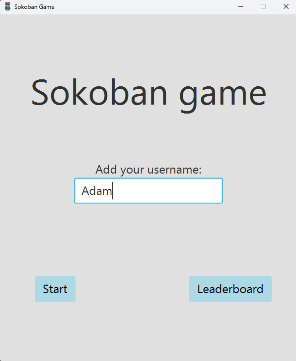
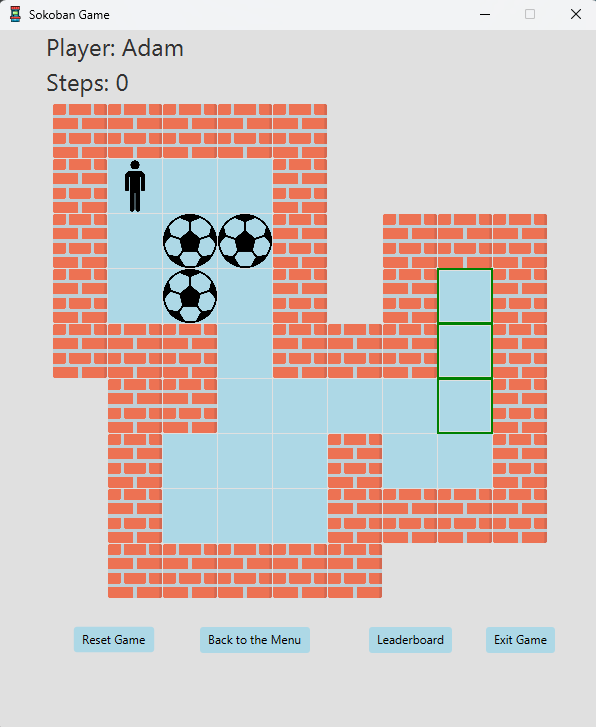
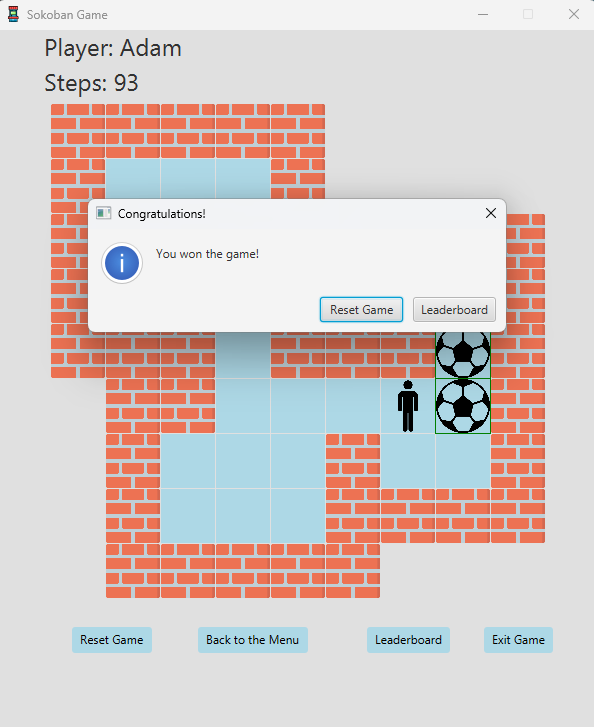
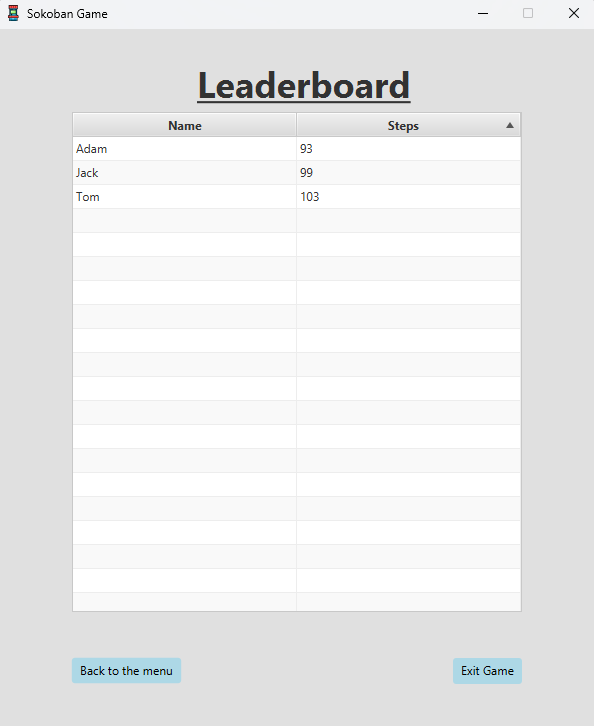

# Sokoban Játék

   Szoftverfejlesztés beadandó - 2023
   A 2. ábrán látható fallal körülvett pályán a játékosnak minden egyes labdát
   el kell juttatnia valamelyik négyzettel jelölt célmezőre. A játékos az aktuális
   pozíciójából négyszomszédos üres mezőre léphet, illetve odébb tolhat egy vele
   négyszomszédos labdát, ha az az üres mezőre kerül.

   
   #### 1. ábra :  Bejelentkezési képernyő
   ###

   
   #### 2. ábra :  Pálya: kezdőállapot
   ###

   
   #### 3. ábra :  Pálya: végállapot
   ###

   
   #### 4. ábra :  Ranglista megjelenítése
